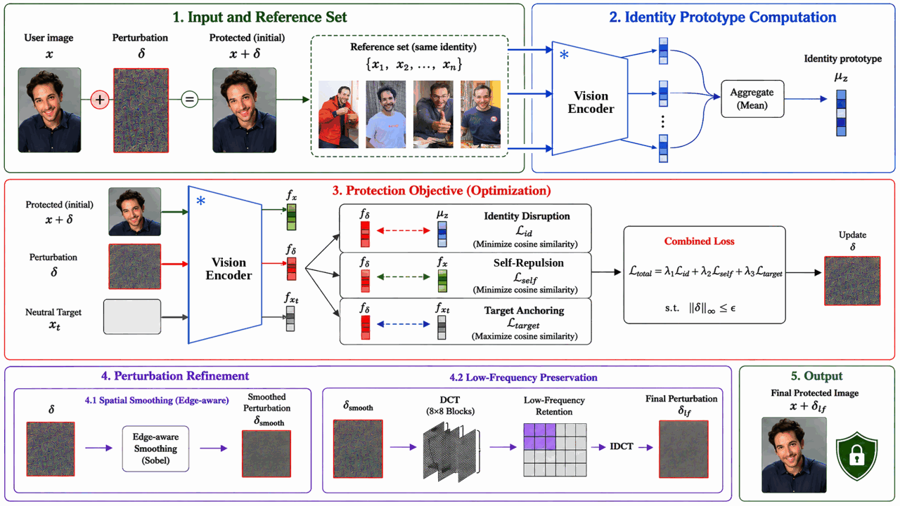

<div align="center">

# Anti-Persona: Protecting Images from Personalized Vision-Language Models

**[Abhishek Basu](#), [Fahad Shamshad](#), [Karthik Nandakumar](#)**

Mohamed bin Zayed University of Artificial Intelligence (MBZUAI)

[](#)
[](LICENSE)
[](#)
[](#)

</div>

<hr>

## 🧠 Overview

<p align="center">
  
</p>

Personalized large vision-language models (LVLMs) — e.g. [Yo'LLaVA](https://github.com/WisconsinAIVision/YoLLaVA)
and [MyVLM](https://github.com/snap-research/MyVLM) — learn a user-specific
concept (a person's identity) from only a handful of reference images, then
answer natural-language queries about that concept. The same capability is a
privacy risk: an adversary can bind a target identity to an off-the-shelf LVLM
and later detect that person in arbitrary images through simple prompts, turning
a general-purpose model into a targeted identity recognizer without consent.

**Anti-Persona** is an image-level defense against this *recognition-based*
personalization. Unlike defenses for generative misuse (Anti-DreamBooth, Glaze,
PhotoGuard), which prevent a model from *synthesizing* a subject, our goal is to
prevent *identity binding and detection*. We optimize an imperceptible
perturbation in the **vision-encoder representation space** — the shared
interface through which both token-based (Yo'LLaVA) and concept-head (MyVLM)
personalization read identity evidence. The key observation is that identity
binding relies on cues that stay **consistent across multiple reference images**;
we therefore attack an **aggregated identity prototype** rather than each image
in isolation, which yields stronger protection and better black-box transfer.

## ✨ Highlights

- **Encoder-space, prototype-level objective.** Protection targets the
  identity-consistent direction shared across references, not a specific prompt
  or personalization head.
- **Task-agnostic & prompt-invariant.** Effective across recognition and
  VQA-style queries and stable across prompt paraphrases.
- **Two threat settings.** *Reactive* (protect the query image at inference) and
  *proactive* (protect the reference images before personalization).
- **Robust & transferable.** Spatial + frequency refinements survive JPEG
  re-compression; the perturbation transfers under black-box encoder mismatch.
- **Imperceptible.** ≈ 39.3 dB PSNR at $\epsilon = 4/255$.

## 📋 Table of Contents

- [Installation](#️-installation)
- [Models & Data](#-models--data)
- [Code Structure](#-code-structure)
- [Method](#-method)
- [Reproducing Tables 1 & 2](#-reproducing-tables-1--2)
- [Reproducibility](#-reproducibility)
- [Citation](#-citation)

## ⚙️ Installation

```bash
bash setup_env.sh          # conda env `anti-persona` + deps + OpenAI CLIP
conda activate anti-persona
```

<details><summary>Manual install</summary>

```bash
conda create -n anti-persona python=3.10 -y
conda activate anti-persona
pip install -r requirements.txt
pip install git+https://github.com/openai/CLIP.git   # imported as `clip`
```
</details>

The protection attack is self-contained on CLIP. The **victim code is vendored**
under `victims/` for plug-and-play reproduction (see [Licensing](#-license)):

| Victim | Personalization | Vendored at | Upstream |
|---|---|---|---|
| Yo'LLaVA | token-based ($\langle sks \rangle$ + prefix tokens) | `victims/yollava/` (`llava` + scripts) | [WisconsinAIVision/YoLLaVA](https://github.com/WisconsinAIVision/YoLLaVA) |
| MyVLM | concept head on the frozen encoder | `victims/myvlm/` | [snap-research/MyVLM](https://github.com/snap-research/MyVLM) |

## 🧩 Models & Data

| Component | Setting |
|---|---|
| Victim vision encoder | OpenAI CLIP ViT-L/14 @ 336px |
| Base LVLM | LLaVA-1.5-13B (`liuhaotian/llava-v1.5-13b`) |
| MyVLM face-recognition head | **CVLface AdaFace IR-101 (WebFace12M)** recognizer + **CVLface DFA-MobileNet** aligner (`minchul/*`, HuggingFace) — an open-source FR model, replacing MyVLM's default InsightFace `buffalo_l` |
| Black-box surrogates | CLIP ViT-B/16, CLIP ViT-L/14@224, OpenCLIP ViT-L/14, CLIPA ViT-L/14@336 |
| Dataset | [Yo'LLaVA benchmark](https://huggingface.co/datasets/thaoshibe/YoLLaVA) — 10 identities, ~15–20 images each |

## 📁 Code Structure

```
anti-persona/
├── anti_persona/             # the protection attack (self-contained on CLIP)
│   ├── attack.py             # ★ objective (L_id + λ1·L_self + λ2·L_target) + PGD + refinements
│   ├── protect.py            # CLI: build the identity prototype, write protected images
│   └── assets/gray_image.png # neutral target anchor x_t (used by default)
├── scripts/
│   ├── protect.sh                    # run the attack (paper config)
│   ├── reproduce_table1_reactive.sh  # Table 1 (reactive)
│   └── reproduce_table2_proactive.sh # Table 2 (proactive)
├── victims/                  # vendored victim code (see Licensing)
│   ├── yollava/              # Apache-2.0: llava/ + personalize.py + evaluate.py
│   └── myvlm/                # Snap non-commercial: myvlm/, concept_heads/ (CVLface FR), ...
├── configs/ours.yaml         # canonical hyperparameters
├── docs/REPRODUCE.md         # step-by-step reproduction
├── licenses/                 # Apache-2.0, Snap MyVLM, third-party notices
└── setup_env.sh  requirements.txt  LICENSE
```

The victim personalization / recognition scripts live under `victims/` and are
run in their own conda environments (they need heavier deps — `llava`, `myvlm`,
CVLface). See [docs/REPRODUCE.md](docs/REPRODUCE.md).

## 🔬 Method

Let $f_\phi$ be the frozen vision encoder and $\mathcal{R}_s=\{x_1,\dots,x_n\}$
the reference set for identity $s$. We form an **identity prototype** as the
centroid of the reference embeddings,

$$\mu_s = \frac{1}{n}\sum_{i=1}^{n} f_\phi(x_i),$$

and optimize a perturbation $\delta$ for a user image $x$ (protected image
$\tilde{x}=x+\delta$) with a three-term objective:

$$\min_{\delta}\;\; \underbrace{\cos\!\big(f_\phi(\tilde{x}),\mu_s\big)}_{\mathcal{L}_{\text{id}}}
+\lambda_1\underbrace{\cos\!\big(f_\phi(\tilde{x}),f_\phi(x)\big)}_{\mathcal{L}_{\text{self}}}
+\lambda_2\underbrace{\big(1-\cos(f_\phi(\tilde{x}),f_\phi(x_t))\big)}_{\mathcal{L}_{\text{target}}}
\quad\text{s.t.}\quad \lVert\delta\rVert_\infty\le\epsilon,$$

where $\mathcal{L}_{\text{id}}$ disrupts the shared identity prototype,
$\mathcal{L}_{\text{self}}$ suppresses residual similarity to the clean image,
and $\mathcal{L}_{\text{target}}$ anchors the representation toward a neutral gray
target $x_t$ for stable optimization. We minimize by projected gradient descent
(sign updates) under the $\ell_\infty$ budget. After each step, two refinements
improve fidelity and compression robustness: **spatial smoothing** of $\delta$
under a Sobel edge mask, and **low-frequency preservation** via a patch-wise DCT
low-pass. The neutral anchor and hyperparameters are in `configs/ours.yaml`:

| $\epsilon$ | steps $T$ | lr | $\lambda_2$ | smoothing $\sigma$ | DCT keep | encoder |
|:--:|:--:|:--:|:--:|:--:|:--:|:--:|
| 4/255 | 500 | 0.5 | 2.0 | 0.8 | 5 | CLIP ViT-L/14@336 |

Generate protected images:

```bash
bash scripts/protect.sh <input_dir> <output_dir>
# equivalently:
python anti_persona/protect.py --input_dir <in> --output_dir <out> \
    --model openai/clip-vit-large-patch14-336 \
    --epsilon 4 --num_iters 500 --lr 0.5 --seed 42 \
    --averageloss_lambda 2.0 --gaussian_sigma 0.8 --dct_keep 5
```

A neutral gray anchor (`anti_persona/assets/gray_image.png`) is used by default;
override with `--target_path`. Run `--help` for the full option list.

## 📊 Reproducing Tables 1 & 2

- **Table 1 — reactive**: victim personalized on *clean* references; the *test*
  image is protected at inference (Yo'LLaVA + MyVLM).
- **Table 2 — proactive**: *reference* images protected before personalization;
  victim trained on protected data, evaluated on *clean* test images (Yo'LLaVA).

```bash
bash scripts/reproduce_table1_reactive.sh <gpu>
bash scripts/reproduce_table2_proactive.sh <gpu>
```

The reactive victims are the authors' 9 Yo'LLaVA checkpoints plus a retrained
seed-7 `yuheng`; hosting and the exact commands are in
[docs/REPRODUCE.md](docs/REPRODUCE.md). The **Protection Rate** (percentage of
queries the personalized LVLM fails to recognize) is the per-category
`x.xxx (c/t)` line printed by `test-sks-acc.py`.

## 🔁 Reproducibility

Verified on a single NVIDIA RTX A6000 (48 GB), `python 3.10 · torch 2.1.2+cu121`:

| Check | Result |
|---|---|
| Protected-image fidelity | **PSNR 39.4 dB**, $\lVert\delta\rVert_\infty = 4/255$ |
| Reactive protection (`thao`, Ours, authors' checkpoint) | **10/10 = 100%** (matches paper) |

The evaluation is deterministic; the PGD attack is not bit-reproducible across
hardware, so pooled Ours protection may vary by a couple of borderline images
(≈ 91–93 %).

## 📖 Citation

```bibtex
@inproceedings{basu2027antipersona,
  title     = {Anti-Persona: Protecting Images from Personalized Vision-Language Models},
  author    = {Basu, Abhishek and Shamshad, Fahad and Nandakumar, Karthik},
  year      = {2027}
}
```

## 🙏 Acknowledgement

Built on [Yo'LLaVA](https://github.com/WisconsinAIVision/YoLLaVA),
[MyVLM](https://github.com/snap-research/MyVLM),
[LLaVA](https://github.com/haotian-liu/LLaVA), and
[OpenCLIP](https://github.com/mlfoundations/open_clip).

## 📄 License

This repository is **mixed-license** — see
[`licenses/THIRD_PARTY_NOTICES.md`](licenses/THIRD_PARTY_NOTICES.md):

- **Our code** (`anti_persona/`, `scripts/`, `configs/`, `docs/`) — [MIT](LICENSE).
- **`victims/yollava/`** — Apache-2.0 (LLaVA / Yo'LLaVA).
- **`victims/myvlm/`** — Snap Inc. **non-commercial, academic-use-only** license
  (redistributed with Snap's notice retained). ⚠️ The MyVLM component may not be
  used for commercial purposes. For a permissive subset, use `anti_persona/` +
  `victims/yollava/` only.
